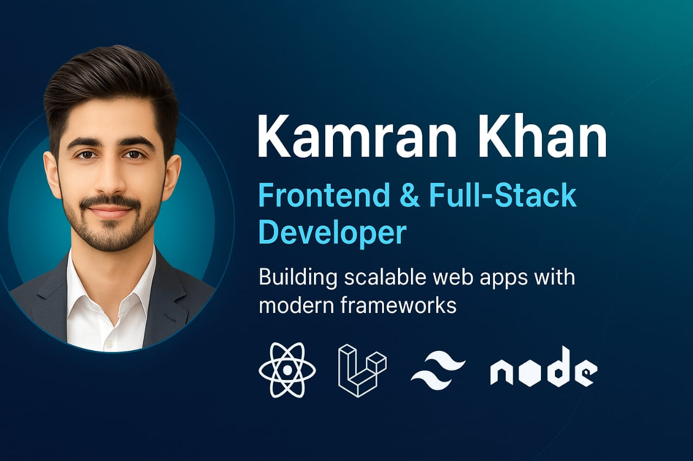

  

# 👋 Hi, I’m Kamran Khan

💻 **Frontend & Full-Stack Developer** specializing in **React.js & Laravel**  
🚀 Passionate about building modern, responsive, and user-friendly web applications  
📍 Lahore, Pakistan • ✉️ [kamrankhanma7@gmail.com](mailto:kamrankhanma7@gmail.com)

---

## 🏆 Featured Projects

- **KickZone** – Sports Management System *(Laravel, Final Year Project)*  
  Role-based platform for managing teams, players, and events.

- **Hospital Management System** *(React.js)*  
  Single-page app to manage patients, staff, and appointments.

- **Pharmacy Management System** *(Laravel)*  
  Inventory and sales management with role-based authentication.

- **Sufeside Media** – E-Commerce *(Laravel)*  
  Full-featured e-commerce website with product catalog, cart, and checkout.

---

## ⚙️ Tech Stack

**Frontend:** React.js, JavaScript (ES6+), Tailwind CSS, Bootstrap, HTML5, CSS3  
**Backend:** Laravel (PHP), MySQL  
**Tools:** Git/GitHub, REST APIs, jQuery, Responsive Design

---

## 📊 GitHub Stats

  
  

---

## 📫 Connect with Me

- [LinkedIn](https://www.linkedin.com/in/kamran-khan-4477a3383)
- [Upwork](https://www.upwork.com/freelancers/~01cb7445d5ef7df0ae?mp_source=share)
- 📧 Email: [kamrankhanma7@gmail.com](mailto:kamrankhanma7@gmail.com)

---

⭐️ *“Always learning, always building.”*
